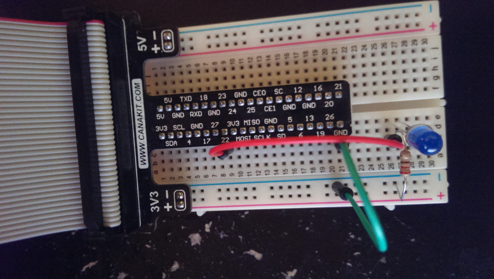

# pi-temperature
*Records and displays temperatures gathered from a Raspberry Pi. Also has some led functionality.*

## Table of Contents
* **[Requirements](#requirements)**
* **[Installation](#installation)**
* **[LED Usage](#led-usage)**
* **[Temperature Usage](#temperature-usage)**

### Requirements
* JDK 7
* Maven 3

### Installation
1. Checkout the project:
```git clone https://github.com/DWiechert/pi-temperature.git```
2. Build the project:
```mvn clean install -Dmaven.test.skip```
3. SCP the built war `<project-directory>/target/pi-temperature-<version>.war` onto your Raspberry Pi.
4. Start the war:
```sudo java -jar pi-temperature-<version>.war```

To check the installation and setup were successful, there is a `hello-world` REST endpoint to test with.
```curl <raspberry-pi-ip>:8080/hello-world```

### LED Usage
REST Endpoint | Return Type | Description
--- | --- | ---
`/led/blink` | void | Pulses the led for 1 second.
`/led/low` | void | Sets the led to low status (off).
`/led/high` | void | Sets the led to high status (on).
`/led/toggle` | void | Toggles the led status.
`/led/pinState` | PinState | Returns the current state of the led - either `LOW` or `HIGH`.
`/led/isLow` | boolean | Returns a boolean indicating if the led is currently in the low (off) state.
`/led/isHigh` | boolean | Returns a boolean indicating if the led is currently in the high (on) state.

*Currently, all of the REST endpoints are wired through pi4j GPIO 03 which maps to board GPIO 22.*


### Temperature Usage
Coming soon.
Follow temperature sheet - http://www.adafruit.com/datasheets/DS18B20.pdf
